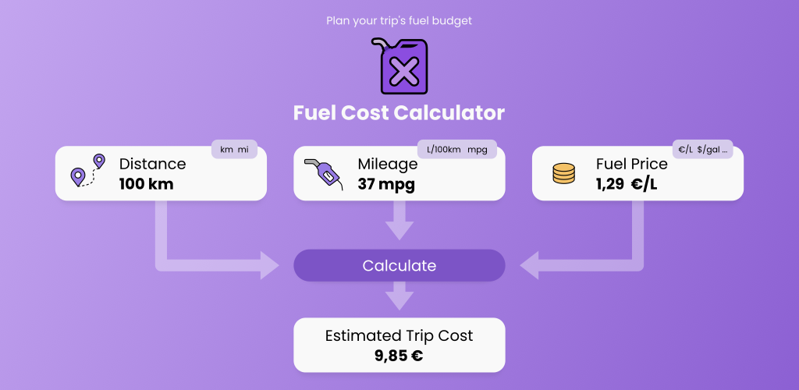
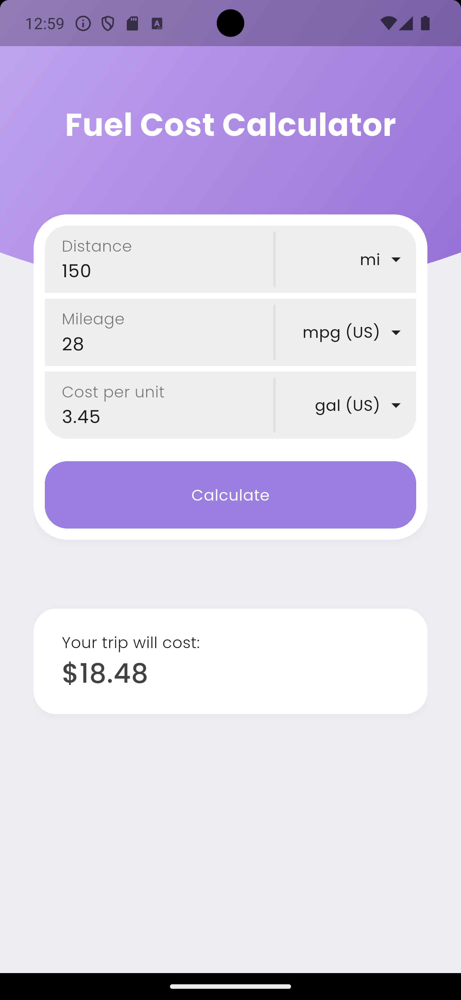
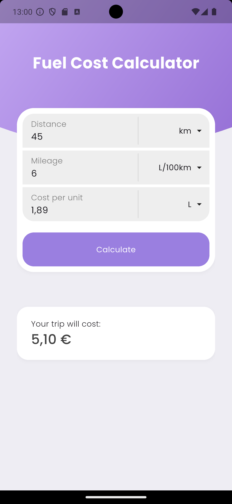

# Fuel Cost Calculator



> [!IMPORTANT]
> **Android Only:** This application is currently only tested and released for Android devices. Support for iOS or other platforms is not available.

An easy-to-use, beautifully designed calculator to help you figure out exactly how much fuel will cost for your next trip.

Whether you use the metric system, imperial system, or a mix of both, this app handles the conversions and calculations for you. Just plug in the current price of fuel, your vehicle's mileage, and the distance you're travelling, and get an instant cost estimate.

## Features

* **Quick Calculations:** Instantly calculate the total cost of your trip
* **Multi-Unit Support:** Seamlessly switch between different units for distance (km, mi), mileage (L/100km, mpg), and fuel volume (L, gal)
* **Smart Localisation:** The currency symbol automatically updates based on your device's main language and region settings
* **Clean UI:** A simple, distraction-free interface built for ease of use

## Screenshots

<p align="center">
  
  &nbsp;&nbsp;&nbsp;&nbsp;
  
  &nbsp;&nbsp;&nbsp;&nbsp;
  
</p>


## Local Development

This project is built with [Flutter](https://flutter.dev/). Here's how to get a local copy up and running

### Prerequisites

You will need the Flutter SDK installed on your machine. If you haven't installed it yet, check out the official [Flutter Installation Guide](https://docs.flutter.dev/get-started/install). You will also need a mobile phone, or an emulator

### Running

Install dependencies:
```sh
flutter pub get
```

Connect your phone, or run an emulator, then run the app:
```sh
flutter run
```
